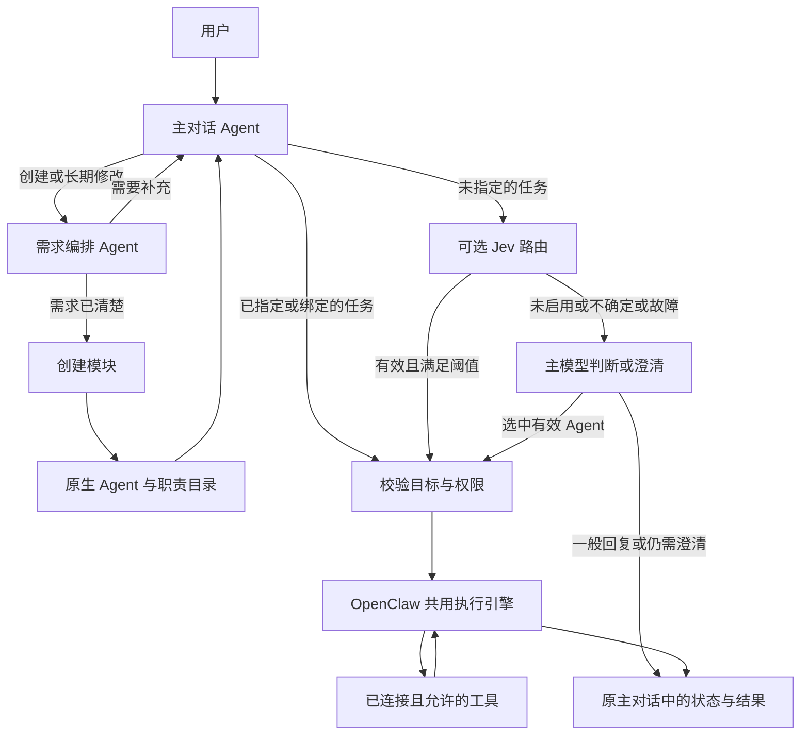

# NEUMA：自然语言创建与调用 Agent

## 产品最终设计报告 v1.0

**设计日期：2026 年 9 月 21 日**  
**设计依据：用户目标、现有 `harness-clean-integration` 项目的静态代码审查，以及 TypeSafe / Jev 官方资料。**  
**状态：建议采用的产品设计基线；尚未实施，性能与效果目标均未实测。**

---

## 1. 产品决策

**NEUMA 让用户用语言创建多个专业助手，并始终通过一个主对话使用它们。**

默认创建产物是一份可执行的 Agent 定义：职责、工作指令、工具权限和上下文配置。多个 Agent 共用执行引擎，各自维护任务上下文。普通助手无需生成独立代码仓。

本次确定六项设计：

1. **一个主对话作为入口。** 用户可以直接提需求，也可以点名某个 Agent。
2. **创建后立即进入调用目录。** “生成设计稿”不能算创建完成。
3. **配置优先。** 通用模型负责理解需求、生成指令和完成开放任务；现有工具提供真实能力。
4. **复用 OpenClaw。** 复用原生 Agent、会话、工具与运行能力，NEUMA 补充自然语言创建和产品交互。
5. **Jev 作为可选的快速决策能力。** 首个试点是主对话路由，通过中文评测后再启用；不成为产品运行前提。
6. **先验证端到端效果。** 第一版集中解决创建、发现、调用、追问、修改和持久化，不扩展内部评审组织。

首版默认面向个人办公，运行在用户自己的电脑上；一个用户管理约 3—20 个 Agent。这里的数量是首版设计与测试范围，不是模型上限。多人共享、企业权限体系与云端托管暂不纳入。

### 1.1 到底有几个 Agent，各管什么

**产品内置 2 个固定角色：主对话 Agent 和需求编排 Agent。用户可以另外创建 N 个工作 Agent。** 需求层所说的“只需要 1 个 Agent”，只统计进入创建流程后的需求编排 Agent；主对话 Agent 是产品入口，处于需求层之外。这里的“角色”是职责分工，可以共用同一模型和执行引擎，不要求部署两个独立服务。

| Agent | 什么时候参与 | 接收什么 | 只负责什么 | 交出什么；不负责什么 |
|---|---|---|---|---|
| **主对话 Agent（内置，1 个）** | 每条用户消息先到这里；任务结果也回到这里 | 用户消息、当前任务状态、可调用 Agent 的职责目录 | 判断用户是要创建、修改、继续任务，还是执行新任务；选择并调用合适的工作 Agent；在主对话展示状态和结果；没有匹配者时处理一般问题或说明缺口 | 向需求编排 Agent 交付创建/长期修改请求，向工作 Agent 交付具体任务。它不替工作 Agent 完成已分派的专业任务，也不独自猜出创建需求的关键缺口 |
| **需求编排 Agent（内置，1 个）** | 仅在创建或修改某个 Agent 的长期职责时参与 | 用户对目标 Agent 的描述、已有定义、与创建相关的对话、已知能力事实 | 把自然语言整理为一份需求说明；发现会改变行为的关键缺口；只问必要问题；保留来源、限制和未解决事项 | 交出“可交接的需求说明”或“待补充的问题”。它不宣布创建成功，不保存 Agent，不执行用户的业务任务 |
| **用户创建的工作 Agent（N 个）** | 主对话选中它，且当前任务落在其职责内时参与 | 本次任务、指定资料、自己的长期指令和允许使用的工具 | 按自身职责完成一个具体任务；必要时提出与本任务有关的问题；返回结果及实际执行状态 | 交回结果给主对话。它不自行修改自己的长期职责，不替主对话选择其他 Agent，首版不直接调用另一个工作 Agent |

创建与保存由**创建模块**完成：它接收需求说明，生成工作指令，核查工具与权限，保存到原生 Agent 目录，并报告是否可用。创建模块是一次受控操作，不维护独立对话，也不算第四个 Agent。**Jev** 只是可选的选择判断器，可以辅助需求缺口判断或主对话路由；它不生成文字、不执行任务，也不算 Agent。

### 1.2 用三个例子看职责边界

| 用户说的话 | 主对话 Agent | 需求编排 Agent | 工作 Agent / 创建模块 |
|---|---|---|---|
| “帮我创建周报助手，根据我发的工作记录写进展、问题和下周计划” | 识别创建请求，并把描述交给需求编排 Agent | 记录目标、资料来源、交付结构；若没有关键缺口，交出需求说明 | 创建模块生成并保存周报助手；此时周报助手还没有执行周报任务 |
| “用这些记录写本周周报” | 从目录选中周报助手，传入记录，接收并展示结果 | 不参与 | 周报助手只依据这次记录生成周报，缺关键记录时提出本任务的问题 |
| “把刚才会议纪要里的待办写进周报” | 找到上一任务已完成的待办结果，作为新任务资料交给周报助手，并展示周报 | 不参与 | 会议纪要助手已完成上一任务；周报助手只根据收到的待办和本次周报要求工作，两者不私下互相调用 |

首版验收用三个职责不同的工作 Agent。它们是用户可创建的示例，不是产品预装的固定角色：

| 工作 Agent | 主对话何时选它 | 它拿到什么、具体做什么 | 交付什么；职责边界 |
|---|---|---|---|
| **周报助手** | 用户要把工作记录整理成周报，或修改一份周报 | 接收用户提供的工作记录、指定时间范围及本次格式要求；归纳进展、问题和下周计划 | 返回周报草稿并指出缺失材料；不自行抓取其他系统的信息，不发送周报 |
| **会议纪要助手** | 用户要从会议转写中提炼结论、待办或纪要 | 接收转写文本；提取已达成的结论、行动项、负责人和期限 | 返回纪要与待办；原文没说的负责人和期限标为待确认，不分派任务或改动日历 |
| **客户回复助手** | 用户要根据客户来信拟一封回复 | 接收来信、用户提供的政策或事实、语气要求；起草回应 | 返回可审核的回复草稿；不擅自承诺价格、期限或政策，不直接发送 |

## 2. 现有项目的取舍

项目已经具备模型调用、需求澄清、工具运行、安装和过程记录等资产。复杂度主要来自默认创建流程承担了完整软件研发职责，以及创建端和使用端维护不同的 Agent 体系。

| 当前实现 | 证据 | 产品决策 |
|---|---|---|
| 架构设计默认进行多角色评审；一个节点中三种角色分别设计、评审，共六次模型调用 | [subagent_review.py](/Users/chriss/Desktop/harness-clean-integration/src/sinan/nodes/subagent_review.py:41) | 普通 Agent 创建不进入该流程；按需开发新工具时才考虑代码研发 |
| 研发层注册 27 个节点，覆盖计划、协商、初始化、开发、测试和修复 | [coding/graph.py](/Users/chriss/Desktop/harness-clean-integration/src/sinan/coding/graph.py:47) | 从默认产品路径移除，迁移期保留已有项目的使用入口 |
| Web 创建在最终设计稿生成后标记完成 | [server.py](/Users/chriss/Desktop/harness-clean-integration/src/sinan/server.py:266) | 完成条件改为 Agent 已保存、能力检查通过且主对话可发现 |
| 现有 `sinan-loader` 插件有独立 registry、Python runner 与 `sinan.*` RPC，未注册模型可直接调用的 Agent 工具 | [plugin.ts](/Users/chriss/Desktop/harness-clean-integration/openclaw/extensions/sinan-loader/src/plugin.ts:113) | 新 Agent 统一使用原生身份；旧 Python 产物仅保留必要桥接 |
| 原生 `agents_list` 读取配置，返回 ID、名称、模型等，但没有业务职责描述 | [agents-list-tool.ts](/Users/chriss/Desktop/harness-clean-integration/openclaw/src/agents/tools/agents-list-tool.ts:66) | 补充职责元数据，生成主对话使用的目录视图 |
| 已有原生 Agent 创建和指定 Agent 执行入口 | [agents.create](/Users/chriss/Desktop/harness-clean-integration/openclaw/src/gateway/server-methods/agents.ts:506)、[sessions_spawn](/Users/chriss/Desktop/harness-clean-integration/openclaw/src/agents/tools/sessions-spawn-tool.ts:474) | 在这些能力上实现创建和调用，避免另建执行引擎 |

以上为本地代码判断，未进行实际服务联调。官方也提供多 Agent 工作区隔离和跨会话工具；集成时仍以本仓库版本的契约为准，不直接照搬最新版配置字段。[OpenClaw 多 Agent 文档](https://docs.openclaw.ai/concepts/multi-agent)、[会话工具文档](https://docs.openclaw.ai/concepts/session-tool)

## 3. 用户价值与首版范围

### 3.1 用户得到什么

用户可以把反复解释的工作方法保存为助手。例如：周报整理、会议纪要、客户回复草拟。再次需要时直接说任务，主对话找到合适的助手，返回实际结果。

Agent 的差异来自职责、工作方法、资料和可用工具。多个名称但同一套泛化指令，不能算有效的多 Agent 产品。

### 3.2 首版包含

| 能力 | 用户可见结果 |
|---|---|
| 自然语言创建 | 描述需求后得到可使用的 Agent 卡片 |
| 自动或指定调用 | 自动选择助手，或使用 `@助手` 明确选择 |
| 连续任务 | “再短一点”“补上风险”继续原任务 |
| 自然语言修改 | 修改长期指令，并明确从哪个版本开始生效 |
| 工具状态 | 清楚知道能读取什么、还缺什么连接 |
| 运行状态 | 显示处理中、等待补充、等待授权、完成、失败 |
| 停用和恢复 | 停用后不再被自动路由，原任务记录保留 |
| 重启恢复 | 已创建 Agent 和已完成结果可恢复，未完成任务有明确状态 |

首版验收使用三个差异明确的助手：周报助手、会议纪要助手、客户回复助手。共同使用用户粘贴或上传的文字材料；文件格式只开放已经验证的解析能力。外部办公系统按已有连接能力逐个接入，不预设飞书、邮箱或浏览器已能使用。

### 3.3 暂缓的能力

不在首版建设 Agent 市场、可视化工作流编辑器、自动生成任意软件、多 Agent 自由协商、自我修改权限、复杂长期记忆或团队共享。

定时执行、复杂的跨 Agent 自动工作流、生成新工具属于后续增量。首版可把一个已完成任务的结果作为另一个 Agent 的新任务输入。用户提出尚不支持的需求时，系统说明缺口，可以保存草稿，不宣称已经完成。

## 4. 核心用户流程

### 4.1 创建一个 Agent

**输入示例：**“帮我建一个周报助手，把工作记录整理成进展、问题和下周计划，控制在 500 字以内。”

1. **主对话 Agent**识别创建意图，把用户描述交给需求编排 Agent。
2. **需求编排 Agent**形成一份需求说明，只追问阻碍执行的信息。风格、名称等非关键项先给合理默认值；目标是常见需求无需追问，必要时一轮问清。
3. **创建模块**根据需求说明生成职责、工作指令和工具引用，并检查工具是否存在、是否已连接、权限是否允许。
4. **创建模块**对无副作用任务使用用户材料试运行；没有材料时展示明确标注的示例输入与结果。外部写入类工具使用预览或模拟，不为了测试而真实发送。
5. **创建模块**保存到原生 Agent，更新可调用目录；**主对话 Agent**展示“已创建，可以直接使用”。若能力缺失则显示“已保存，待连接”。

用户已经明确要求创建时，不再默认增加一次“是否允许保存”的确认。新增外部访问、扩大权限和真实对外动作，沿用工具层的具体授权流程。

**完成定义：**名称、职责和指令已保存；工具可用性已检查；原生 Agent 可加载；目录能发现它。完成定义不包含“必须产生一份架构报告”。

### 4.2 自动调用

**输入示例：**“把这些记录整理成这周周报。”

系统选择周报助手，显示“周报助手正在处理”，将本次输入、附件引用和必要上下文交给它。结果直接出现在主对话中，附上执行者和来源。

通常不需要主 Agent 再调用一次模型改写专业助手的完整结果。需要解释跨任务关系或汇总多个结果时，才由主 Agent 再整理。

### 4.3 追问与修改的区别

| 用户表达 | 行为 |
|---|---|
| “这份再短一点” | 继续当前任务，不修改 Agent 的长期指令 |
| “以后周报都控制在 300 字以内” | 更新周报助手的长期规则，返回变更摘要 |
| “用会议助手处理一下这段录音转写” | 切换到指定助手的新任务 |
| “用刚才的周报再写一封邮件” | 将选定结果作为新任务输入，不转交全部会话 |
| “换一个助手试试” | 选择新的执行者，保留原结果供比较 |

任务绑定 Agent 版本和会话。进行中的任务继续使用启动时的版本，新任务使用更新后的版本；用户明确要求把新规则应用于当前任务时再更新该任务。

### 4.4 模糊、失败与缺少能力

- 两个助手都可能适合：给出简短选择，或由主模型结合上下文判断。
- 没有匹配助手：主对话直接处理可完成的请求；用户确有复用意图时再建议创建。
- 缺少连接：保留 Agent，列出具体连接项，不反复重新创建。
- 工具失败：告知哪一步失败及已完成结果，提供重试或补充信息入口。
- 用户停止：取消尚未执行的步骤，说明已经发生的动作；停止不等于撤销外部操作。
- 请求需要多个助手：首版允许拆成用户可确认的连续任务，不启动隐藏的多层协商。

## 5. 页面与信息架构

### 主界面

```text
┌─────────────────┬──────────────────────────────────────┐
│ 我的助手         │ 主对话                               │
│ + 创建助手       │                                      │
│ 周报助手         │ 用户：整理这周工作记录                 │
│ 会议纪要助手     │                                      │
│ 客户回复助手     │ 周报助手 · 正在整理                    │
│                 │ 结果正文 / 文件                        │
│ 最近任务         │ [继续修改] [换助手] [查看过程]          │
│ 周报 · 完成      │                                      │
│ 回复 · 待补充    │ 输入需求、上传资料或 @助手              │
└─────────────────┴──────────────────────────────────────┘
```

Agent 详情使用侧栏，默认只显示名称、职责、工作规则、可用工具和状态。编辑规则可以直接说话。模型型号等技术选项放在高级设置。

任务详情显示输入、结果、工具动作、失败原因和必要来源。原有节点图谱、完整 Prompt 和模型调用账本进入开发调试入口，不占据日常创建流程。

Jev 的名称、概率和阈值不出现在普通用户操作流程中。用户只需要知道正在由哪个助手处理，以及是否需要补充信息。

## 6. 最小数据与系统结构

### 6.1 三种业务对象

以下是 NEUMA 的逻辑数据设计，不是声称现有 OpenClaw API 接受这些字段。

| 对象 | 必要内容 | 存储归属 |
|---|---|---|
| Agent | 原生 `agent_id`、名称、职责及排除范围、工作指令、工具策略、版本、启用状态 | 身份和执行配置使用 OpenClaw 原生能力；仅产品元数据放插件存储 |
| Task | `task_id`、主会话、执行会话、Agent 与版本、输入引用、状态、结果引用 | 复用原生会话与任务记录；缺少的关联字段放插件存储 |
| Decision | 选择结果、目录版本、路由后端、模型版本、耗时、是否回退 | 必要的本地诊断记录，避免重复保存整段敏感输入 |

目录是从有效 Agent 和职责元数据生成的视图，不再建立另一套 Agent 身份注册表。插件数据使用宿主已有存储能力，不为 NEUMA 额外部署数据库服务。主对话和被调用助手不共享完整历史。

Agent 创建采用“先保存草稿，校验完成再变为可路由”的顺序；重复请求使用同一创建操作标识，失败重试不产生多个同名助手。停用后保留任务历史，删除采取明确操作，不与普通改名混用。

### 6.2 部署与职责



保留一个 OpenClaw Gateway 和 Web UI，NEUMA 作为薄插件接入。创建和路由属于同一产品内的函数或工具，不分别部署微服务。Jev 可通过现有 Node/TypeScript 侧接入；官方提供 JavaScript/TypeScript 客户端和 HTTP 接口，没有必要仅为它新增 Python 服务。[SDK 文档](https://docs.typesafe.ai/sdk)

Python 三层 Builder 在迁移期间作为旧模式运行；配置创建路径完成后，普通创建不再依赖该服务。OpenClaw 源码暂不做大范围删除或升级；先收敛自有代码边界，之后再单独评估外置依赖。

## 7. Jev 能用在哪里

### 7.1 已核实的技术边界

TypeSafe 于 2026 年 9 月 15 日发布 System One / Jev，定位是输出结构化决策的模型，发布时处于 early access。文章给出的速度优势来自其特定任务与测试环境，不能当作 NEUMA 的实测承诺。[发布文章](https://typesafe.ai/blog/introducing-system-one-models-and-jev)

| 原语 | 含义 | NEUMA 候选用途 |
|---|---|---|
| Choice | 在给定候选中选择，返回概率分布 | 选 Agent、选已有工具或固定分支 |
| Noul | 判断某一命题为真的概率 | 资料相关性、单项规则判断 |
| Score | 按有顺序的标准评分 | 候选资料排序、抽样质量检查 |

这些原语不负责生成新名称、指令、报告或代码。[原语概览](https://docs.typesafe.ai/introduction)、[Noul](https://docs.typesafe.ai/primitives/noul)、[Score](https://docs.typesafe.ai/primitives/score)

截至本次核查，官方模型页列出 `jev-1.13.0`，仅接受文本，价格为每百万输入 token 0.042 美元，输出不计费；英语是主要训练语言，其他语言包括中文的效果需单独验证。生产实验应固定版本，不能让 `latest` 自动变化后继续沿用旧阈值。[模型与价格](https://docs.typesafe.ai/models)

**类型正确只约束输出形状，不证明选中的 Agent 或业务结论正确。** 官方限制页明确列出数字精度、日期比较、复杂间接推理、无关长上下文和对抗性输入等薄弱点。因此计算、权限和执行状态仍由程序判断，Jev 不承担唯一安全判定职责。[已知限制](https://docs.typesafe.ai/model-jaggedness/jev-1.13)

Choice / Score 的 `confidence` 是从概率分布计算的统计量，不等于所选项概率，也不等于实际正确率；Noul 没有单独的 `confidence`。两种原语的阈值不能直接通用。[置信度说明](https://docs.typesafe.ai/confidence)

### 7.2 使用优先级

| 环节 | 是否使用 Jev | 决策 |
|---|---|---|
| 主对话选择 Agent | **首个实验** | 候选明确、频率高、容易比较路由正确率 |
| 从已有工具中推荐能力 | 后续可试 | 仅推荐已存在能力，程序检查可用性与权限 |
| 大量资料的相关性筛选 | 后续可试 | 先有真实批量场景，再对照人工标注评估漏选 |
| 稳定业务规则中的语义分支 | 后续可试 | 程序负责流程和数值判断，Jev 判断语义条件 |
| 输出质量检查 | 抽样试验 | 作为辅助信号，不自动宣告事实正确或任务成功 |
| 生成 Agent 指令、澄清问题、报告 | 不使用 | 由通用生成模型完成 |
| 金额计算、日期运算、鉴权、动作去重 | 不使用 | 程序可以精确完成 |
| 任意任务规划和多步推理 | 不替换通用模型 | 保留原生 Agent 执行循环 |

采纳的是“让封闭选择使用结构化决策”的思路。首版只增加一个有收益证据的决策位置，不把每一步都拆成模型判断。

## 8. 主对话路由设计

### 8.1 基线与优化路径

先实现不依赖 Jev 的基线：主模型获得职责目录，调用原生会话工具完成选择和交接。Jev 接入后只替换可明确判断的入口选择；低置信度、错误和不支持的输入回到这条基线。

1. **程序先处理明确状态。** UI 中选定的 `@Agent`、绑定任务的继续按钮、取消操作和绑定动作的审批回复直接交给相应处理器。普通文字中的“继续”不靠关键词强行绑定。
2. **取得候选快照。** 只包含当前用户可调用、已启用且已就绪的 Agent，以及必要的系统选项。
3. **需要语义选择时调用 Jev。** 输入本条消息、少量必要前文、当前任务摘要及精简职责目录。
4. **验证决策。** 候选是否仍存在、是否可调用、是否与任务状态冲突、是否满足经验证的路由阈值。
5. **执行或回退。** 有效决策交给目标；否则回到主模型。主模型能够判断的，不再机械地要求用户确认。

### 8.2 使用一个主要选择问题

建议候选项为：`create_agent`、`manage_agent`、`general_chat`、`needs_clarification`、`agent:<id>`，以及适用时的 `continue:<task_id>`。这些是拟议的内部决策值，不是现有 SDK 方法名。

每个选项都写明适用和排除范围。目录由可信配置生成，资料正文只作为待判断数据。第一版不把“意图”和“目标 Agent”拆成两个独立预测再直接组合，避免出现“创建意图 + 运行目标”不一致的执行指令。

Choice 支持从封闭候选集中选择，并建议在候选不完整时提供兜底选项；单个 Choice 的官方上限是 255 个选项。首版的 3—20 个 Agent 足以直接列出，无需额外建设向量检索路由。[Choice 文档](https://docs.typesafe.ai/primitives/choice)

如果未来目录很大，再独立验证检索候选的召回率；否则候选召回错误会被误认为 Jev 的选择错误。

### 8.3 接受条件与回退

阈值不是预设的产品事实。实施时在校准集上选择最佳候选概率、第一第二候选差值等门槛，记录 `confidence` 供诊断；以独立测试集上的实际正确率决定是否接受快速路由。

```text
明确的用户选择 / 已绑定的操作
    → 程序校验 → 调用

其他输入且 Jev 已启用
    → 一次路由判断
    → 目标有效且达到校准门槛：调用
    → 不确定 / 目标失效 / 超时 / 错误：主模型判断

Jev 未启用
    → 主模型判断
```

路由超时预算初始设为 1 秒，属于待测试参数，包含客户端重试耗时。前台链路不连续重试拖延回复；发生限流或过载时回到基线。后台评测可退避重试。官方 API 列出了 `429` 与 `529` 等错误，客户端默认重试必须受到前台总时限约束。[API 文档](https://docs.typesafe.ai/api)

任何模型决策都只决定把任务交给谁，不能扩大该 Agent 的工具权限。创建、停用和修改配置须在相应工具中校验用户请求；外部副作用按具体动作控制。

## 9. 执行、上下文和结果回传

### 9.1 共用执行引擎

普通 Agent 使用原生运行循环：读取自身指令与当前任务，调用模型，执行允许的工具，回填结果，直到完成、需要用户补充或达到预算。

初期沿用宿主已有的超时、取消和调用限制，不创建新的通用工作流引擎。每个助手只暴露需要的工具；工具使用权限由程序实施，不能只写在 Prompt 中。

### 9.2 上下文范围

- 主对话保留用户需求、任务关联和结果摘要。
- 被调用 Agent 接收任务正文、指定材料和完成任务必要的约束，不默认接收所有历史。
- 同一任务的追问发送到原执行会话；不同任务可使用同一 Agent 的新会话。
- 跨 Agent 传递以选定结果和资料引用为单位，不默认共享私有记忆。
- 长期偏好在用户明确表达“以后都这样”时写入，普通一次性修改不自动变成永久规则。

### 9.3 异步状态

原生子任务启动成功表示已受理，不表示结果已完成。NEUMA 需建立 `task_id ↔ session/run` 关联，接收原生完成、失败和取消事件，并将最终结果写回发起的主对话。

任务状态使用一组明确值：排队、运行中、等待输入、等待授权、完成、失败、已取消。重启后根据宿主真实运行记录恢复；无法恢复的在途任务显示“已中断，可重试”，不能直接标记完成。

对外写入动作使用工具支持的幂等标识或执行回执。遇到“请求超时但可能已执行”的情况先查询结果，不自动重复发送。审批只针对尚未授权的具体动作，已批准的同一动作不重复询问。

## 10. Jev 的效果、延迟和成本验证

### 10.1 不以厂商演示作为验收

官方工作流评估使用大模型共识作为参考标签，并假设工作流本身正确。它可以帮助理解实验方法，不能证明中文办公场景中的真实正确率。[评估方法](https://evals.typesafe.ai/)

本次未调用 Jev 的真实推理 API；访问资格、实际网络延迟、中文效果和账户可用额度仍未验证。产品基础路径无需等待这些条件。

### 10.2 首轮评测集

建立 300 条中文路由样本，按会话和语义模板划分 120 条校准集、180 条固定测试集，避免同义改写落在两边造成泄漏。

| 样本类型 | 数量 |
|---|---:|
| 明确指定与常规任务 | 80 |
| 职责重叠、需要澄清 | 60 |
| 追问、改长期规则、切换话题 | 60 |
| 创建与管理请求 | 40 |
| 无匹配助手、工具未连接 | 30 |
| 误导性输入、越权目标与混合语言 | 30 |

人工标签允许“多个可接受目标”以及“应追问”，不强迫每句话只有唯一答案。记录请求当时的 Agent 目录；加入新增或改名助手后的测试。工具权限和目录失效等程序行为另做确定性测试。

比较三条完整路径：

- A：规则与主模型的基线。
- B：同一候选目录下的 Jev 路由，加真实回退路径。
- C：必要时选一个轻量通用模型作为路由对照，确认收益来自实际能力和延迟，而非只与较慢模型比较。

TypeSafe 提供通用 LLM 对照适配器，可用于离线比较；不因此为产品引入第二个执行系统，也不把 LLM 自报概率当作已校准概率。[官方对照适配器](https://github.com/typesafe-ai/system-one-adapter-python)

### 10.3 发布门槛

以下均为建议目标，不是当前结果；测试数量较小时同时报告样本数、错误样例及置信区间。

| 指标 | 初始目标与口径 |
|---|---|
| 自动接受的 Jev 路由正确率 | 固定测试集上 ≥98%；只统计实际自动执行的选择 |
| 快速路径覆盖率 | 在没有明确 UI 绑定的语义请求中 ≥70%，与正确率同时报告 |
| 路由增量耗时 | 目标部署网络下 p95 ≤1 秒，计入预处理与失败处理 |
| 端到端效果 | 不低于主模型基线；评估任务结果，不只看路由命中 |
| 追问连续性 | 确定性任务关联测试全部通过，语义追问另计正确率 |
| 故障回退 | 注入超时、无效响应、限流、目录变化，全部走正确回退分支 |
| 权限与副作用 | 未授权工具被程序阻止；不能用平均模型准确率替代 |

300 条只是首轮可行性验证，不足以证明所有边界安全。先在明确的只读或生成类任务中小范围启用，依据真实错误样例扩充测试。若低准确率或高回退率抵消收益，保持 Jev 关闭，首版照常发布。

### 10.4 成本和延迟模型

按前述官方单价，假设一次路由总输入 2,000 token，则模型输入费约为：

`2,000 / 1,000,000 × $0.042 = $0.000084 / 次`。

10 万次约 8.40 美元。该示例不含执行 Agent、主模型回退、重试、工具服务和基础设施费用；实际 token 必须计入职责目录和问题描述，不能只算用户一句话。

设 `p` 为 Jev 直接路由成功比例，则相比原有主模型调度，粗略条件为：

`Jev 路由费 < p × 被省掉的主模型调度费`。

总耗时也应计入低置信度请求先等 Jev、再等主模型的代价。只有快速路径真正跳过主模型调度时，这种优化才可能成立；如果每次仍完整调用主模型，就只是新增一笔成本和等待。

## 11. 实施顺序与代码边界

| 阶段 | 工作 | 对应现有位置 | 退出条件 |
|---|---|---|---|
| A：接通使用闭环 | 用两个原生 Agent 打通主对话调用、任务绑定和回传 | 原生会话工具、NEUMA 插件与主聊天集成处 | 指定调用、自动选择、连续追问、失败和重启都能解释清楚 |
| B：轻量创建 | 新增模型可调用的创建/修改能力，复用原生创建和工作区文件接口，补充职责元数据 | `sinan-loader` 插件；原生 `agents.create` / 文件写入契约 | 从自然语言创建出的助手无需 CLI 搬运即可使用 |
| C：Jev 实验 | 实现一个路由适配模块、版本记录、时限和基线回退；运行中文评测 | NEUMA 插件内部，不新增常驻服务 | 达到第 10 节门槛，否则不开启 |
| D：收缩旧链路 | 页面转为主对话与助手列表；迁移旧 Agent；默认创建不再走三层 Builder | Python `server.py`、`graph.py`、`coding/`；现有旧版 UI | 默认创建不依赖 Python Builder，已有有效产物有明确归宿 |

阶段 A、B 完成即可构成可交付首版。阶段 C 可独立失败；不影响产品可用性。阶段 D 的删除依据实际使用清单逐项执行，不批量删除尚未迁移的 Agent 或用户资料。

实现时不让插件直接导入 OpenClaw 私有核心函数。原生 RPC、插件工具、宿主运行能力之间的调用接缝，需要先核对本地 SDK 契约，再选择已有公开接口；若必须扩展接口，应做一个明确的小改动，避免为了“薄封装”建立不稳定依赖。

旧 Python Agent 的处理：简单任务转为原生配置；有独特执行逻辑的保留为受控工具或显式旧模式；没有实际使用价值的产物在核对后归档。目标是最终一套身份目录和一套主对话入口，过渡桥接应有退出清单。

开发拆分按可验收行为组织，不按“需求 Agent、架构 Agent、评估 Agent”等角色组织。每个阶段先实现最小纵向流程，再补充对应失败路径和测试。

## 12. 发布验收与后续边界

首版用三类助手完成以下验收：

1. 通过中文描述创建，各自职责清晰，重复提交不重复创建。
2. 未点名时能选择合适助手，点名时遵从用户选择。
3. “这次修改”和“以后都这样”分别影响任务与长期配置。
4. 新增、修改、停用立即反映在下一次目录读取中。
5. 用户追问继续原任务，切换任务不串入其他助手历史。
6. 工具未连接、模型失败、用户取消均有明确状态。
7. 重启后 Agent 和结果仍在，无法恢复的执行不伪装成功。
8. Jev 不可用时仍能完成创建与调用。
9. 需要对外动作时，正确使用现有权限和具体动作授权机制。
10. 普通用户无需阅读设计稿、节点图或命令行日志即可完成以上流程。

后续只在出现明确需求后增加：定时执行复用宿主调度；跨 Agent 自动工作流从有限顺序交接扩展；新能力优先接现有工具；重复使用的稳定业务分支再考虑 Jev；用户确实需要长期积累知识时再扩展记忆。

**研发优先级固定为：先让创建出的 Agent 真正可用，再让主对话稳定调用，最后优化调用的速度和成本。**

## 附：依据、假设与验证范围

- 仓库审查对象：[harness-clean-integration](/Users/chriss/Desktop/harness-clean-integration)。本次未修改该仓库、未运行真实模型或重新执行测试。
- 产品规模、验收阈值、1 秒路由预算和实施顺序均为本报告的设计建议，可根据实测调整。
- Jev 能力与价格依据截至 2026-09-21 可读取的官方文档；固定版本和账户条件仍需接入时核查。
- 官方隐私政策说明输入不用于训练，但不等于默认零保留。本产品只向路由服务发送必要状态；是否允许该第三方处理资料应在连接配置中明确，企业敏感数据场景须另行核实保留和部署条件。[隐私政策](https://typesafe.ai/legal/privacy-policy)
- 本报告只进行了公开资料研究，没有向 TypeSafe 上传项目文件、用户资料或实际对话，也没有安装 SDK、申请账户或创建付费资源。
