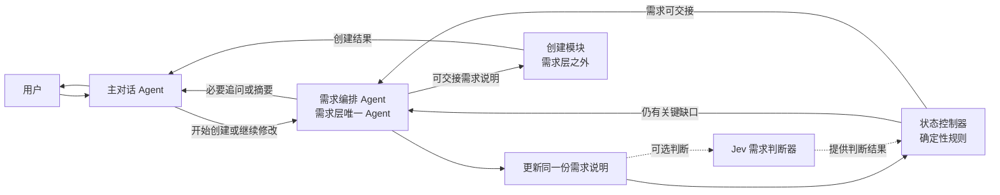

# NEUMA 需求层产品设计报告 v1.1

日期：2026 年 9 月 22 日  
范围：从用户表达创建意图，到形成可用于创建 Agent 的需求说明。  
性质：需求层产品设计方案，尚未实施。

品牌名：**NEUMA**（读作“纽玛”）  
品牌含义：源自早期音乐记谱中的 *neuma*。它把声音变成可组织、可复现的结构，对应本产品把用户的语言描述变成可运行的 Agent，并通过主对话协调多个 Agent。  
品牌标语：**Describe the role. Conduct the work.**（说出角色，让协作开始。）

## 1. 设计目标

**让用户通过尽量少的自然对话，说清楚希望 Agent 做什么，并得到一份准确、可修改的需求说明。**

需求层的任务是理解、澄清和记录。它的完成结果是“需求已经足够清楚”，此时不能显示“Agent 已创建”。

本报告确定需求层的产品行为、Agent 数量、内部协作关系，以及 Jev 在需求判断中的位置。不展开后续架构生成、代码生成、Agent 运行和多 Agent 任务路由。

首版采用一个明确入口：用户主动提出创建助手的意图。普通任务是否自动推荐保存成 Agent，暂不纳入本次范围。

## 2. 需求层到底需要几个 Agent

### 2.1 结论：只需要 1 个 Agent

需求层首版只设置一个 **需求编排 Agent**。整个产品另有一个处于需求层之外的**主对话 Agent**，以及用户创建的 N 个工作 Agent。主对话 Agent 接收所有用户消息；进入创建或长期修改流程时，才调用需求编排 Agent。需求编排 Agent 整理需求并生成追问或摘要，由主对话展示给用户。用户创建的工作 Agent 此时不参与。

需求理解、缺口识别、追问、摘要和交接是同一项工作的连续阶段，共享同一份需求说明，不需要拆成访谈 Agent、分析 Agent、挑战 Agent和总结 Agent。拆开后会增加模型调用、上下文同步和意见合并，但不会增加新的权限边界或独立业务能力。

除主对话 Agent 和需求编排 Agent 外，需求层还有两个辅助组件，它们都不算 Agent：

| 参与者 | 是否属于需求层 Agent | 职责 | 明确不做什么 |
|---|---:|---|---|
| 主对话 Agent | 否，属于产品入口 | 接收用户消息；把创建或长期修改请求交给需求层；展示追问、摘要和后续创建结果 | 不在需求层内重复整理需求；不把“需求已清楚”说成“Agent 已创建” |
| 需求编排 Agent | **是，需求层唯一的 Agent** | 从用户原话更新唯一需求说明；找出会改变行为的缺口；生成一个必要追问或可交接摘要；说明能力依赖 | 不决定技术架构，不保存或运行用户要创建的 Agent，不负责一般任务路由 |
| Jev 需求判断器 | 否，是模型能力组件 | 对当前需求做固定选项的结构化判断，提供概率和置信度 | 不生成问题文本，不写需求说明，不直接回复用户 |
| 状态控制器 | 否，是普通程序逻辑 | 保存需求状态，执行确定性规则，决定继续追问或允许交接 | 不理解自然语言，不自行补充用户需求 |

### 2.2 需求编排 Agent 的输入与输出

**输入：** 用户本轮消息、与本次创建有关的对话、当前需求说明、已有连接和能力事实；使用 Jev 时，在更新草稿后接收其结构化判断结果。

**输出只能是以下三类之一：**

1. 更新后的需求说明与一个必要追问。
2. 更新后的需求说明与可交接摘要。
3. 更新后的需求说明与明确的能力依赖、暂存或取消状态。

需求编排 Agent 不拥有“直接创建成功”的输出。只有后续创建模块保存并校验成功后，主对话才能告诉用户 Agent 已创建。

### 2.3 各参与者之间的关系



这里不是多个 Agent 互相聊天。需求编排 Agent 负责语言工作；Jev 负责固定问题的概率判断；状态控制器负责最终流程规则。三者围绕同一份需求说明工作，不产生多份相互竞争的结论。

### 2.4 一轮对话的内部顺序

1. 主对话把创建会话交给需求编排 Agent。
2. 需求编排 Agent 从用户原话中提取信息，并更新唯一的需求说明。
3. Jev 对更新后的紧凑状态并行回答若干原子判断。
4. 状态控制器把 Jev 结果、必填规则和能力事实合并，选出下一动作。
5. 需要补充时，需求编排 Agent 只生成一个最重要的问题；可以交接时，生成简短摘要。两者都经主对话展示；可交接的需求说明随后交给创建模块。

如果 Jev 不可用，第 3 步跳过，由需求编排 Agent 按相同字段规则判断，流程仍可完成。

## 3. Jev 如何融入需求层

### 3.1 产品结论

**可以融入，但它应当是需求编排 Agent 内部的判断器，而不是第二个 Agent，也不能成为需求层运行的硬依赖。**

TypeSafe 把 Jev 定位为“非结构化状态输入、类型化概率决策输出”的 System One 模型。它不生成字符串，适合分类、路由、评分和分支判断；Choice、Score、Noul 可以在一次请求中并行判断。这个能力与需求层的“是否还有关键缺口、下一步问什么”高度匹配。[官方介绍](https://docs.typesafe.ai/introduction) [发布说明](https://typesafe.ai/blog/introducing-system-one-models-and-jev)

### 3.2 Jev 适合做什么

| 需求判断 | Jev 原语 | 返回结果如何使用 |
|---|---|---|
| 核心任务是否已经明确 | Noul | 作为是否允许交接的一项条件 |
| 输入或资料来源是否明确 | Noul | 判断是否需要追问来源 |
| 交付物是否明确 | Noul | 判断是否需要追问输出 |
| 是否存在会阻塞执行的冲突 | Noul | 存在冲突时禁止交接 |
| 是否涉及发送、修改、删除等外部动作 | Noul | 触发更严格的边界检查 |
| 下一步最需要处理哪类缺口 | Choice | 在目标、来源、输出、触发方式、动作边界、冲突、无缺口中选择一项 |

Noul 返回“是”的概率；Choice 返回固定选项、选项概率分布和置信度。它们适合让程序直接分支，不需要从一段生成文字中再次解析结果。[Noul 文档](https://docs.typesafe.ai/primitives/noul) [Choice 文档](https://docs.typesafe.ai/primitives/choice)

不建议只问一个笼统问题，例如“需求完整度是多少”。官方建议把复杂判断拆成独立、范围清楚的原子问题，再由代码组合。因此，是否可交接由多个判断和确定性规则共同决定，不能依赖一个总分。

### 3.3 Jev 不适合做什么

- 不负责理解后直接生成需求说明、追问或摘要；它不生成文本。
- 不负责决定完整业务流程；多步推理、间接判断和复杂权衡仍由需求编排 Agent 与代码承担。
- 不负责计数、时间比较和字段一致性校验；这些由程序处理。
- 不读取未经筛选的全部长对话；只接收本轮原话、紧凑需求说明和与当前判断有关的事实。
- 不直接把概率当作事实，也不在低置信度时自动替用户做关键决定。

Jev 1.13 的官方说明列出了字面理解、数字、日期比较、长且无关的状态、间接推理和生成等已知弱项，因此必须保持上述边界。[Jev 1.13 已知边界](https://docs.typesafe.ai/model-jaggedness/jev-1.13)

### 3.4 推荐的单次判断结果

每轮只调用一次 Jev，在同一次请求中并行得到以下逻辑结果：

```text
goal_clear                核心任务是否明确
source_clear              关键输入与来源是否明确
deliverable_clear         交付物是否明确
has_blocking_conflict     是否存在阻塞冲突
has_external_action       是否涉及外部动作
external_boundary_clear   外部动作对象和范围是否明确
next_gap                  下一项：目标/来源/输出/触发/边界/冲突/无缺口
```

发送给 Jev 的状态只包含：用户最新原话、当前需求说明、字段来源标记和已知能力事实。问题的选项中必须包含“无缺口”或“以上都不是”，避免强迫模型从不适合的选项中选择。

### 3.5 决策规则与降级

状态控制器按照以下原则决定下一步：

1. 目标、来源和交付物满足当前任务所需，且没有阻塞冲突，才允许进入“可交接”。
2. 涉及外部动作时，动作对象、范围和触发方式也必须清楚。
3. Jev 对 `next_gap` 的置信度足够高时，需求编排 Agent 围绕该缺口组织自然语言问题。
4. 置信度处于中间区间时，需求编排 Agent 结合原文复核；置信度低、请求超时或服务失败时，直接走原有规则，不向用户暴露内部故障。
5. 概率阈值不能凭产品文档永久写死，应按风险和中文评测结果校准；如按具体版本调过阈值，应固定模型版本，避免别名升级后结果悄然变化。[置信度说明](https://docs.typesafe.ai/confidence) [模型版本说明](https://docs.typesafe.ai/models)

### 3.6 上线策略

Jev 当前以英语训练效果最好，官方说明中文等 CJK 内容需要用自身数据验证。因此建议分三步接入：[语言支持说明](https://docs.typesafe.ai/models#language-support)

1. **离线评测：** 用真实中文创建对话验证每个原子判断。
2. **影子运行：** Jev 给出判断但不影响用户流程，与现有判断结果对比并记录分歧。
3. **受控启用：** 只让高置信度结果参与“下一问题类别”的选择；低置信度和异常始终降级。

首版产品可以预留 Jev 适配接口，但在中文评测通过前不把它设为必经路径。这样能使用新模型的速度和结构化输出优势，也不会让需求层被单一外部服务锁住。

## 4. 用户体验与页面

用户在主对话说“帮我创建一个……”即可开始，也可以点击“创建助手”。两种入口进入同一个对话流程。

界面保留三种内容：

| 内容 | 展示方式 |
|---|---|
| 用户需求和补充信息 | 普通聊天消息 |
| 必要追问 | 一句清楚的问题；适合时附 2—3 个快捷选项，始终允许自由回答 |
| 需求摘要 | 对话中的一张简短卡片，展示“做什么、根据什么、交付什么、还缺什么” |

不展示内部评审角色、需求评分、辩论过程和长篇契约。用户可以随时说“不是这个意思”“把这一点改一下”，无需重新开始。

如果用户已充分说明需求，系统直接给出摘要并进入创建交接，不安排例行问答。

## 5. 需求层需要弄清什么

只收集会影响助手行为的信息，不要求每个字段都通过提问获取。

| 信息 | 要回答的问题 | 收集原则 |
|---|---|---|
| 核心目标 | 这个助手主要帮用户完成什么？ | 必须清楚；不能只留下“提高效率”这样的抽象描述 |
| 输入与来源 | 它依据哪些资料工作，资料从哪里来？ | 必须区分用户提供和主动获取；不强迫用户填写技术细节 |
| 工作方式与边界 | 有哪些必须遵守的步骤？哪些事情不能做？ | 仅记录用户要求或影响结果的关键边界，不主动扩写复杂流程 |
| 交付与成功标准 | 最后给用户什么，怎样算有用？ | 至少明确交付物；字数、结构等按用户要求补充 |
| 使用方式 | 用户需要时调用，还是在特定时间或事件触发？ | 未提出自动化时默认按需调用，并在摘要中说明 |

名称和语气可以先给默认值。模型、框架、数据库、节点数量不属于用户需求问题。

**默认值只能补齐非关键偏好。** 不得默认选择外部数据来源、收件人、发送权限、删除范围或自动执行频率。

### 需求信息的三种来源

- **用户已说明**：直接来自用户描述或后续回答。
- **系统暂定**：不影响核心目标的默认值，例如临时名称；应可见、可改。
- **尚未明确**：真实缺口，不把猜测写成用户已确认的要求。

系统已经知道的事实不重复问用户，例如某个连接是否已配置。能查询时查询；不能核实时标记待核实，不擅自声称可用。

## 6. 对话流程

```text
用户提出创建需求
        ↓
提取已知信息，形成需求草稿
        ↓
检查：是否还有会改变执行或结果的关键缺口？
        ├─ 有 → 提出最重要的问题 → 接收回答、修正草稿
        └─ 无 → 展示简短需求摘要 → 交给创建环节

任何时候：用户都可修改、暂存或取消
```

### 6.1 第一步：理解原话

先保留用户真正提出的任务、资料和限制。不要把一个简单需求自动扩展成完整业务系统。

例如“把我发来的工作记录整理成周报”，不应擅自增加自动抓取、多平台同步、定时发送和团队审批。

如果目标足够清楚，直接进入摘要。只有存在关键缺口时才追问。

### 6.2 第二步：针对缺口追问

一次优先问一个最重要的问题；两个紧密相关且容易回答的问题可以合并。选择题用于帮助表达，不能强迫用户从不合适的选项中选择。

提问优先级：

1. 先确定到底要完成什么。
2. 再确定关键资料和来源。
3. 再确定交付物，以及是否涉及对外动作。
4. 最后补充确实重要的个性化要求。

不要把这四项机械执行为固定四轮。用户已经说清的内容直接跳过。

### 6.3 第三步：收敛并交接

需求清楚后展示摘要。例如：

> **周报助手**  
> 根据你发送的工作记录，整理成“本周进展、问题、下周计划”三部分。  
> 控制在 500 字以内；没有提供的信息不编造。  
> 你需要时调用，结果返回当前对话。

用户已经要求创建且不存在关键歧义时，不再强制增加“确认需求”“确认设计”等多次确认。摘要明确后即可交给创建环节，用户仍能继续修改。

若存在未解决的关键问题，显示“需求待补充”。若需求本身清楚、但缺少连接或暂不支持某项能力，显示“需求已整理，待连接/暂不支持”，不继续用无关问题拖延结束。

## 7. 追问与停止规则

### 7.1 什么时候必须问

一个问题的不同回答会显著改变目标、资料来源、交付对象或动作范围时，应当追问。

| 用户表达 | 必要追问 | 原因 |
|---|---|---|
| “做一个工作助手” | “你最希望它先帮你完成哪件事？” | 目标过于宽泛 |
| “做一个周报助手” | “工作记录由你发给它，还是希望它从指定地方获取？” | 输入方式影响能力范围 |
| “做一个客户回复助手” | “它只帮你起草回复，还是需要直接发送？” | 起草与发送有不同的动作边界 |
| “自动整理客户反馈” | “客户反馈主要来自哪里？” | 自动获取依赖具体来源 |
| “报告要很详细，但只写一句话” | 指出冲突，询问哪个要求优先 | 不能把冲突要求一起当作可执行标准 |

### 7.2 什么时候不问

- 用户已经明确说过，或能从当前对话直接确定。
- 缺少的是名称、一般语气等可调整偏好。
- 问题只是为了填满表格，对执行没有实质影响。
- 问题属于实现方案，例如“要几个子 Agent”“要不要向量数据库”。
- 用户已给出足够具体的范例，可先按范例归纳并说明理解。

### 7.3 如何控制轮数

常见需求的体验目标是 **0—2 轮必要追问**，这不是强制收尾上限。

两轮后仍有关键缺口时，明确说明还缺什么，并让用户选择继续说明或暂存草稿。用户说“你来决定”时，可以决定低影响偏好；涉及来源、收件人或对外动作的缺口必须保留，不能因轮数耗尽而自动视为确认。

### 7.4 什么算需求层完成

同时满足以下条件：

1. 能用一句话准确说明助手的主要任务。
2. 知道任务依据什么输入，关键来源没有被猜测。
3. 知道应该交付什么，以及用户明确要求的成功标准。
4. 用户明确提出的限制已保留，不存在会改变核心行为的未解冲突。
5. 所有尚未明确的信息均不阻碍需求交接，或已明确标为能力依赖。

**需求完整度与能力可用性分开判断。** “知道用户想读取飞书文档”可以是清楚的需求；“已经有权限读取”则是另一项需要核实的事实。

## 8. 唯一交接产物：Agent 需求说明

需求层只保留一份持续更新的需求说明，不再分别生成扩展需求、挑战意见、辩论结论和多份同义契约。

建议的逻辑结构如下。这是产品数据设计，不是现有接口格式。

| 内容 | 示例 |
|---|---|
| 名称 | 周报助手，系统暂定 |
| 目标 | 将工作记录整理成周报 |
| 输入与来源 | 用户在对话中提供文字记录 |
| 工作要求与边界 | 不编造记录中未提供的成果；缺少关键内容时提示 |
| 交付标准 | 进展、问题、下周计划三部分；500 字以内 |
| 使用方式 | 按需调用，结果返回当前对话 |
| 未解决问题与能力依赖 | 无；或注明待连接的资料来源 |

各项保留“用户说明/系统暂定/未明确”的来源标记。原始对话作为追溯依据，不复制为多套业务产物。用户更改要求时更新同一份说明，保留必要的修改记录。

首版不要求额外生成完整测试集或验收长文。用户提供的样例可以随需求保留，作为下一环节试运行的输入。

## 9. 三个完整案例

### 案例 A：一句话已经足够

**用户：**“创建一个会议纪要助手。我把转写文字发给它，它帮我提炼结论和待办，待办写明负责人和截止时间，原文没说就标注待确认。”

**系统行为：**直接生成摘要并交接，不再询问资料来源、输出格式或负责人如何处理。

**交接重点：**只依据用户提供的转写；提炼结论和待办；不能猜测未出现的负责人和截止时间。

### 案例 B：需要一次关键追问

**用户：**“我要一个周报助手。”

**系统：**“工作记录由你发给它，还是希望它从指定地方获取？”

**用户：**“我直接发给它，帮我整理成进展、问题和下周计划。”

**系统行为：**生成摘要并交接。按需调用、返回当前对话作为可见默认值，不额外追问名称、颜色、模型或架构。

### 案例 C：需求清楚但能力待核实

**用户：**“创建一个助手，每周五下午从我的飞书项目文档生成周报，然后发到项目群。”

**系统：**“请提供项目文档和目标群，并说明周五下午的具体时间。”

**用户：**提供文档、群和时间。

**系统行为：**记录定时、来源、交付对象与动作范围。能核查连接时进行核查；不能核查时标记待核实。若定时或发送能力尚未支持，保留完整需求并明确限制。

不能把此需求悄悄改成“用户手动粘贴内容、只生成草稿”，也不能在需求层宣称定时任务已经生效。

## 10. 最小实现范围与验收

### 10.1 最小实现

需求层只实现一个需求编排 Agent、一个澄清对话循环和一份结构化需求草稿。每轮完成三件事：更新已知信息、判断关键缺口、返回必要问题或最终摘要。

程序负责检查必需信息、维护状态和保存修改。Jev 通过可替换的判断器接口接入；接口关闭或调用失败时，需求编排 Agent 仍能完成整个流程。首版不引入多角色辩论，也不设置独立需求评审 Agent。

建议状态只有三种：**整理中、待补充、可交接**。连接不足和能力限制作为独立标记，避免把“需求清楚”混同为“已经能运行”。用户取消或暂存属于会话操作，不伪装为完成。

### 10.2 验收用例

| 用例 | 必须达到的行为 |
|---|---|
| 信息完整 | 不追问已知项，直接形成准确摘要 |
| 目标模糊 | 先问核心任务，不提前扩写功能 |
| 缺少关键来源 | 追问或标记缺口，不编造来源 |
| 用户修改想法 | 更新当前需求，清除已失效的旧要求 |
| 要求冲突 | 指出具体冲突，不自动替用户决定关键取舍 |
| 用户要求“简单一点” | 缩小到核心任务，不保留额外扩展功能 |
| 达到两轮仍未清楚 | 说明缺口，支持继续或暂存，不强制完成 |
| 能力不可用 | 保留真实需求，说明依赖，不声称已创建可运行助手 |
| 重复提交回答 | 不重复推进轮次，不生成重复需求 |
| 用户取消 | 停止继续追问和交接 |
| Jev 判断低置信度 | 不自动交接，交由需求编排 Agent复核或追问 |
| Jev 服务异常 | 用户流程继续，不丢失需求草稿，不展示底层错误 |
| Jev 与确定性规则冲突 | 以确定性规则为准，并记录分歧供评测 |

### 10.3 效果指标

首轮验证使用上述案例及其真实改写，重点观察：

- 用户已明确的目标、边界是否被遗漏或改写。
- 是否存在无依据扩展功能、编造来源和强制确认。
- 常见需求能否在 0—2 轮必要追问内完成。
- 需求交接后，下一环节是否仍需重复询问同一关键问题。

Jev 在参与真实决策前，另用不少于 300 条中文创建对话建立评测集，至少覆盖完整需求、关键缺口、要求冲突和外部动作四类。初始上线门槛建议为：阻塞缺口被错误判为可交接的比例不高于 2%，下一缺口类别判断准确率不低于 90%，且服务失败时全部正确降级。速度和成本使用实际调用数据评估，不直接把厂商展示数据当作产品验收结果。

轮次少不能单独代表成功。**需求层的交付标准是：用最少的必要沟通，留下足够准确的需求。**
