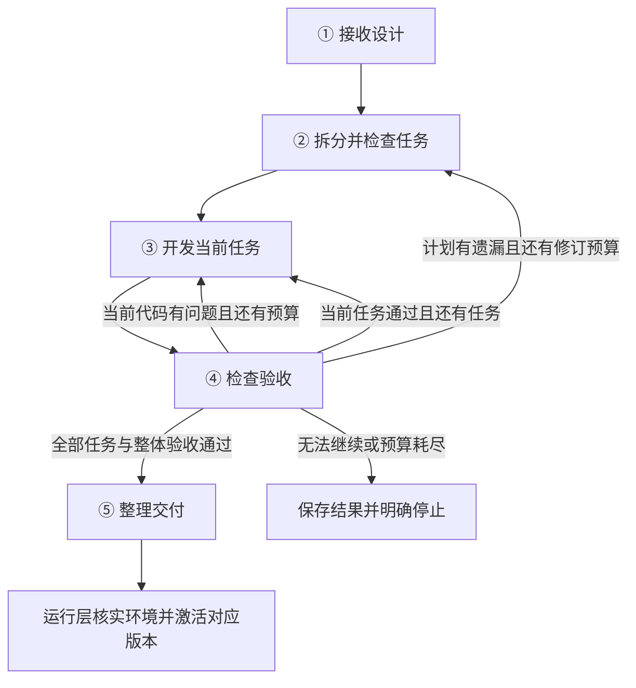

# NEUMA 研发层最终设计

2026 年 10 月 4 日定稿，本轮已按此设计接入研发控制器、Pi 会话交接、代码验收与运行交付。2026-10-08 为 npm 安装增加平台执行适配：macOS 保留实际探测；Windows LPAC/Job Object 与 Linux Landlock/seccomp 提供辅助程序。2026-10-09，Linux 在 Ubuntu 24.04/26.04、x64/ARM64 的云端原生检查通过；Windows 已编译，实际隔离启动仍在验证。缺少程序或探测失败时阻塞，完整安装与桌面验收尚未完成。任务通过 stdin 固定启动层恢复现有 argv[2] 接口，单个 JSON 输出和控制器验收门槛保持不变。正式外部连接、后台触发及其他运行时仍需相应适配。本文与项目 ARCHITECTURE.md 一起作为实现和验收依据。

研发层负责把已经评估通过的架构，变成有代码、有测试证据、可以交给运行层检查的交付物。采用 **五个主节点、两种 Agent 角色、一个程序控制器**。Agent 统一使用项目现有 Pi SDK 底座。

## 一 整体流程



节点是流程阶段，角色是职责，会话是上下文容器。五个节点不等于五个 Agent；两种角色也不等于只有两个会话。

第一版顺序执行任务。同一工作区一次只有一个开发者写代码，开发停止写入后才对固定代码版本进行验收。初始化、读取进度、保存文件、创建会话和提交检查点均是节点内部的普通程序操作。

## 二 五个节点的明确分工

| 节点 | 输入与工作 | 输出与进入下一步的条件 |
|---|---|---|
| ① 接收设计 | 程序接收已通过评估的架构，冻结需求、架构版本与候选摘要值，核实开发和测试所需条件，建立独立研发工作区 | 研发输入包、初始检查点。架构存在阻断项或必要执行条件缺失时，明确阻塞 |
| ② 拆分并检查任务 | 开发角色在独立规划会话中拆任务；程序检查引用、依赖和覆盖；评审角色独立检查计划 | 已通过检查的任务计划。每项有目标、范围、依赖、验收方式和完成条件；不通过则带意见限次修订 |
| ③ 开发当前任务 | 控制器选择依赖已满足的任务，提供交接上下文；开发角色读取代码、实现、自测并提交结果 | 实际代码快照、变更说明、已知问题。Agent 的“完成”只是提交验收，不能直接标记通过 |
| ④ 检查验收 | 程序对代码快照执行测试；评审角色独立检查代码、需求覆盖和证据。包含任务验收与整体验收两种模式 | 绑定代码版本的验证报告、结构化问题单。程序测试通过且无阻断评审问题才能放行 |
| ⑤ 整理交付 | 程序封装已验证代码、入口、依赖、配置要求、权限声明与验证证据，再次核对上游版本 | 不可变交付包与研发完成记录。运行层检查和激活成功后，才能把对应版本显示为可运行 |

节点②包含计划评审，但没有新增第三种 Agent。它使用同一种评审角色的新会话，检查“任务拆得对不对”；节点④检查“代码做得对不对”。

任务计划必须绑定原始需求与架构验收条目。开发者可以选择实现细节；超出当前任务改动范围时，先由控制器核对并修订任务授权。改变目标、范围、关键接口或权限，需要回到架构层形成新版本，研发层不能自行降低要求。

## 三 角色与上下文生命周期

### 两种角色和一个控制器

- **开发角色**：规划、实现、自测、修复。规划阶段只提供必要的只读资料工具；编码阶段才装配该任务允许的代码读写和受控执行工具。
- **评审角色**：检查计划、代码和验收证据。每次使用全新只读会话，不修改代码，不继承开发者的完整聊天历史。
- **程序控制器**：创建会话、选择任务、保存状态、执行测试、管理预算、判断是否通过、处理恢复与交付。模型不能自行改写通过状态。

### 上下文放在哪里

| 位置 | 保存内容 | 保存期限 |
|---|---|---|
| Pi 会话内存 | 本任务对话、读过的代码、工具返回、当前尝试和修复过程 | 当前会话存活期间 |
| 项目研发记录 | 冻结设计、任务计划与状态、尝试次数、交接记录、验证证据及下一步 | 跨会话、跨进程保留 |
| 研发代码工作区及快照 | 实际源代码、依赖定义、任务改动、可恢复的代码版本 | 跨会话保留；交付使用固定版本 |

项目研发记录是业务事实来源。Pi 会话提供当前工作的连续上下文；即使会话丢失，也能根据记录和代码重新接手。

### 会话什么时候保留或重建

| 情况 | 会话规则 |
|---|---|
| 拆分任务及一次计划修订 | 使用规划会话；修订时明确加入被拒版本和评审意见。计划通过后关闭 |
| 开始任务 A | 新建开发会话 A，不沿用规划会话 |
| A 编码、自测、验收失败后修复 | 保留开发会话 A。控制器把失败证据作为新输入交回它；等待验收期间不允许继续改代码 |
| A 通过，开始任务 B | 关闭 A，保存交接记录，再新建开发会话 B |
| 每次计划评审、任务评审或整体验收评审 | 新建独立评审会话，完成即关闭 |
| 当前任务过长，需要续接 | 在工具执行结束的安全边界保存检查点，关闭旧会话，以同一个任务的新会话续接；预算不重置 |
| 服务重启或进程崩溃后继续 | 先核实代码与检查点，再新建会话；恢复工作进度，不承诺恢复旧会话的全部记忆 |

实际例子：

```text
规划会话 P：拆出 A、B、C → 计划通过 → 关闭

开发会话 A：实现 A → 自测 → 等待验收
评审会话 R1：检查 A → 不通过 → 关闭
开发会话 A：收到失败证据 → 修复
评审会话 R2：重新检查 A → 通过 → 关闭
保存 A 的交接记录 → 关闭开发会话 A

开发会话 B：读取 A 的结果摘要和现有代码 → 实现 B
后续按同样规则推进，最后进行整体验收
```

每个新开发会话都接收三组材料：固定开发规则与架构约束；当前任务、验收要求、依赖任务摘要和代码入口；最近失败证据与下一步动作。完整代码按需读取，长日志通过文件引用获取。

固定规则会重复提供，任务材料随任务变化。前一个任务的完整聊天不复制到下一个任务。与当前任务相关的接口、决定和未解决问题必须进入交接记录。

上下文阈值根据实际模型窗口配置，并预留工具返回和交接输出空间。控制器在阈值前安排续接；SDK 的自动压缩可以辅助会话运行，但不能代替项目检查点。即使突然溢出，也能从最近检查点重建，不依赖模型临时写出一份完美总结。

## 四 最小交接协议

保留五类业务记录，具体可以使用文件或同一份结构化存储，不要求拆成五个服务。

| 记录 | 必备信息 | 谁能确认写入 |
|---|---|---|
| 研发输入 | 稳定 Agent ID、研发批次、需求快照、架构版本与候选摘要值、范围、约束、能力条件 | 控制器 |
| 任务账本 | 计划版本、任务 ID、需求及验收引用、依赖、允许改动范围、状态、尝试次数、阻塞原因 | 开发角色提案，控制器校验后保存 |
| 工作交接 | 当前任务、代码快照、改动文件、已完成事项、已知问题、下一步及相关资料引用 | 开发角色提供说明，控制器补入实际文件和版本事实 |
| 验证证据 | 代码与计划版本、测试用例版本、执行命令、退出码、实际结果、日志引用、评审结论和问题 ID | 测试执行器与评审角色分别产出，控制器保存 |
| 交付记录 | 不可变交付定义保存产物版本、入口协议、运行时、依赖锁定、配置项名称、权限需求和验证引用；另存引用该版本的运行检查与激活记录 | 控制器生成交付定义，运行层另写运行记录 |

一份交接摘要可以很短，例如：

> 任务 A 已实现文件读取接口，验收针对代码快照 S12 通过。接口位置与调用约定见关联文件。下一项是任务 B 的内容提取，继续使用该接口。尚未连接正式外部服务，现有测试只验证模拟接口。

失败交接不能只有“测试失败”。必须包含失败用例 ID、复现输入、期望与实际结果、错误类别、对应代码版本和需要修复的问题。测试原始结果独立保存，不能只依赖评审 Agent 转述，否则模型漏写的问题会丢失。

## 五 验收与失败流转

### 两级验收

**任务验收**运行当前任务的验收测试和已完成功能的回归测试，再独立评审。首版默认重跑全部已有自动化验收，后续有可靠依赖分析时再做增量优化。

**整体验收**在所有任务完成后，针对同一份最终代码快照运行完整测试、集成检查和整体需求覆盖评审。各任务曾经通过不能代替整体验收。

持久状态架构的用例按冻结计划顺序在同一个全新临时工作目录连续执行，以验证跨调用读写；不同验收轮次重新创建目录并清理。普通任务的用例各用独立临时目录。测试不会借用工作 Agent 的真实用户文件。

通过要求：关键验收实际执行并通过，评审没有阻断问题，结果绑定当前代码、计划和架构版本。测试需核实具体值、业务条件、状态变化或规定错误；启动成功、返回正确字段名、模型自称完成均不足以证明业务通过。

程序测试结果使用“通过、失败、未执行、执行异常”四种状态。超时和环境故障不能当作负向用例通过。负向用例必须匹配预期拒绝行为或错误码。使用模拟服务的结果要明确标注，不能声称正式外部连接已验证。

验收要求在计划阶段确定；开发角色可补测试，但不能自行删除、放宽已确认断言。测试程序同样按生成代码处理，在受控执行环境内运行。任何验收要求变更都要形成新计划版本并重新检查。

### 失败返回哪里

| 失败原因 | 处理方式 |
|---|---|
| 当前任务实现错误或回归失败 | 回③，将完整证据交回当前开发会话，修复后重跑验收 |
| 全部任务后发现集成问题 | 建立引用原需求和失败证据的修复任务，开新开发会话；修复后重新整体验收 |
| 任务遗漏或依赖拆分有误 | 回②修订计划，只处理受影响部分；计划版本变化后复核相关通过记录 |
| 架构矛盾或需求范围必须改变 | 阻塞当前研发，将具体问题交回架构层；不能自动扩写需求 |
| 模型连接、测试环境或工具执行异常 | 记录执行异常，保留检查点；按受限基础设施重试策略处理，不算业务验收通过 |
| 缺少开发或测试必需条件 | 阻塞并说明条件。若只缺最终运行连接，可继续完成隔离开发，交付仍标记待连接 |

### 自动处理预算

以下是首版可配置默认值，不代表模型能力保证：计划最多修订一次；同一任务初始开发后最多修复两次；整体验收最多发起两次集成修复。一次研发额外设六次自动纠错总预算，计划修订、任务修复和集成修复共同消耗它，局部与总预算以先耗尽者为准。

预算在开始尝试前持久化扣减。新会话、恢复、重新进入节点或建立集成修复任务都不能刷新旧问题的预算。规划及单次评审最多十二个模型回合；单个开发任务累计最多四十个模型回合，包含修复与上下文续接。执行命令还需有限超时与输出上限。

预算耗尽后保存问题并明确失败或阻塞，绝不自动通过。模型传输重试由现有 Pi 适配层控制，业务控制器不叠加另一套无限网络重试；SDK 结束状态也不能代替测试通过。

## 六 持久化 恢复与执行边界

### 检查点

每次进入阶段、模型提交、测试结束和状态迁移都记录必要状态。代码、测试报告和交接材料保存为带版本的快照，最后原子发布引用这些快照的检查点清单；任务账本只在相关材料保存成功后推进。

检查点至少包含：当前阶段和任务、架构与计划版本、代码快照、已验证版本、尝试次数、剩余预算、最近证据及下一步动作。允许保存未通过代码作为工作检查点，但必须与已验证版本明确区分。

本版使用每个 Agent 独立的本地原子文件存储：`.neuma/agents/<id>/development/records/` 保存检查点，`development/workspaces/<runId>/code/` 保存每轮代码，`development/snapshots/<hash>/` 保存只读快照。工作区和快照接口显式绑定 Agent ID，相同代码摘要在不同 Agent 下独立保存；运行时必须核实归属。旧格式由统一存储层在研发加载前迁移，快照路径重定位但摘要、预算和验收证据保持不变。删除标记阻止残留记录恢复，代码与快照保留。同一 Agent 的构建、研发和激活共用互斥规则，避免两个流程同时发布同一 Agent 的版本。每轮研发使用独立工作区，已有工作 Agent 的用户文件和记忆不作为代码生成目录。

### 中断与取消

服务重启时，未完成的研发记录标记为中断。继续时核对已发布检查点、实际工作区及残留进程；存在未记录改动则先保留新快照并标记未验证。中断中的测试按未完成处理，隔离且可重复的测试可以重跑。不能确认副作用是否完成的操作，先核实，不盲目重放。

取消会停止调度、终止 Pi 会话和受管执行进程，并保留已有改动。每次写入结果前核对取消标记和当前运行标识，迟到结果不得把取消状态改成成功。取消不承诺撤销已经发生的外部动作。

### 工具和代码执行

开发会话只拥有研发工作区的受限文件工具，以及经过执行器控制的构建和测试能力。需求、通过状态、预算和正式交付记录不开放给模型任意写入。评审会话只读指定代码快照及证据。

允许执行生成代码时，执行器必须提供实际的隔离环境、有限运行时、进程终止和输出收集。设置 cwd 或过滤命令字符串不构成隔离。宿主项目管理工具、用户凭据和正式业务连接不会自动授予研发 Agent。

外部依赖安装、联网范围和执行能力由经评估的构建配置控制；未获授权的外部写入不纳入自动测试。执行隔离不可用时应阻塞执行验证，不能退回无边界运行并报告成功。

## 七 交付与现有 NEUMA 的衔接

### 接入入口

现有 light 路径继续从已评估方案生成轻量执行定义。对架构已经通过、交付标记为需要研发的 workflow 或 custom 方案，接入本研发控制器。

现有 buildable 表示当前系统能直接生成执行定义，不能作为新研发层的唯一入口门槛。新增入口需要单独核实架构通过状态、未解决阻断项、研发条件和用户请求，而不是把旧 buildable 强行改为 true。

### SDK 与模块职责

复用现有 createPiSession、受控资源加载、模型接入、取消和结构化 submit 工具模式。为开发、规划、评审配置不同工具和提示词；研发控制器单独管理任务会话生命周期。现有架构角色函数结束即释放会话，不能原样用于需要跨验收保留的开发会话。

Pi 负责单个角色的模型与工具循环；控制器负责五阶段流转、业务记录与完成判断；测试执行器负责真实执行证据；运行层适配器负责启动、停止、连接校验与激活。前端继续消费 NEUMA 自有状态和结果，不直接依赖 Pi 原生事件。

首版优先实现与当前 Node 和 Pi 底座一致的产物执行适配。架构选定其他运行时后，必须具备对应的测试执行器与运行适配器才开放自动交付；能力未实现时保留待研发状态。

### 完成与可运行分别记录

研发过程记录“进行中、已完成、阻塞、失败、已取消、已中断”，当前阶段独立保存。运行交付继续沿用“阻塞、待连接、待研发、可运行”。例如代码验收与打包已完成，但正式服务尚未连接，可以同时显示“研发已完成，待连接”。

运行层必须核实入口协议、实际运行时、锁定依赖、配置、授权工具与必要连接，并完成受控启动检查。运行检查与激活结果另存为引用交付包版本的记录，不修改不可变交付包。

运行层没有相应执行能力时，交付包保留，不能显示可运行。预期中的正式连接缺失可标记待连接，不撤回研发完成状态。打包错误或运行冒烟暴露产物缺陷时，研发恢复为进行中，原交付版本标记存在缺陷且禁止激活；沿用原预算修复，重新验收后生成新交付版本，原包只作为历史保留。

交付包绑定 Agent ID、需求版本、架构版本及候选摘要值、代码与验证版本。激活前再次检查绑定仍有效，以原子方式切换活动版本。版本已经过期时保留产物并阻塞激活，不能覆盖新版。

旧的有效版本和用户数据保留。已有运行任务绑定启动时版本；新版失败或尚未激活时，不能拿旧定义冒充新版可用。执行成功、研发成功与实际发送消息或写入外部服务也必须分别表达。

## 八 实现后的验收标准

1. 规划会话、开发会话和评审会话按本设计隔离；同一任务修复能接到完整失败证据。
2. 任务 A 完成后关闭会话，任务 B 仅凭交接包和现有代码即可正确接手。
3. 上下文续接和服务重启后，任务身份、代码版本、已完成进度及剩余预算保持一致。
4. 当前任务导致旧功能回归、整体验收发现跨任务错误时，都能进入正确修复路径。
5. 模型报告成功、测试未执行、负例超时、证据对应旧代码、评审含阻断问题等情况均不能通过。
6. 取消后迟到结果不能继续推进；新架构版本出现后旧产物不能激活；旧可用版本及用户数据保留。
7. 代码通过但缺少运行连接时显示待连接；有交付包但缺少运行适配器时显示待研发。
8. 首版用可控模型替身测试状态流转，用真实 Pi SDK 配合本机模拟模型验证会话协议，并单独验证隔离执行与受控部署检查；真实业务效果另做代表性场景验收。

## 设计依据

本设计吸收参考项目的文件交接、执行与验收分工、失败检查点和有界修复，并补足其反馈传递、上下文续接与证据版本绑定。它没有迁移参考项目的 Claude 会话实现。

- [NEUMA 当前架构基线](/Users/chriss/Desktop/办公智能体/neuma-requirements/ARCHITECTURE.md)
- [现有 Pi 会话封装](../src/runtime/pi-runtime.mjs)
- [现有结构化提交与独立角色机制](../src/architecture/architecture.mjs)
- [参考项目研发层节点契约](/Users/chriss/Desktop/harness-clean-integration/src/sinan/coding/NODES.md)
- [参考项目独立验收](/Users/chriss/Desktop/harness-clean-integration/src/sinan/coding/nodes/evaluator_qa.py:65)
- [Pi SDK 官方说明](https://pi.dev/docs/latest/sdk)
